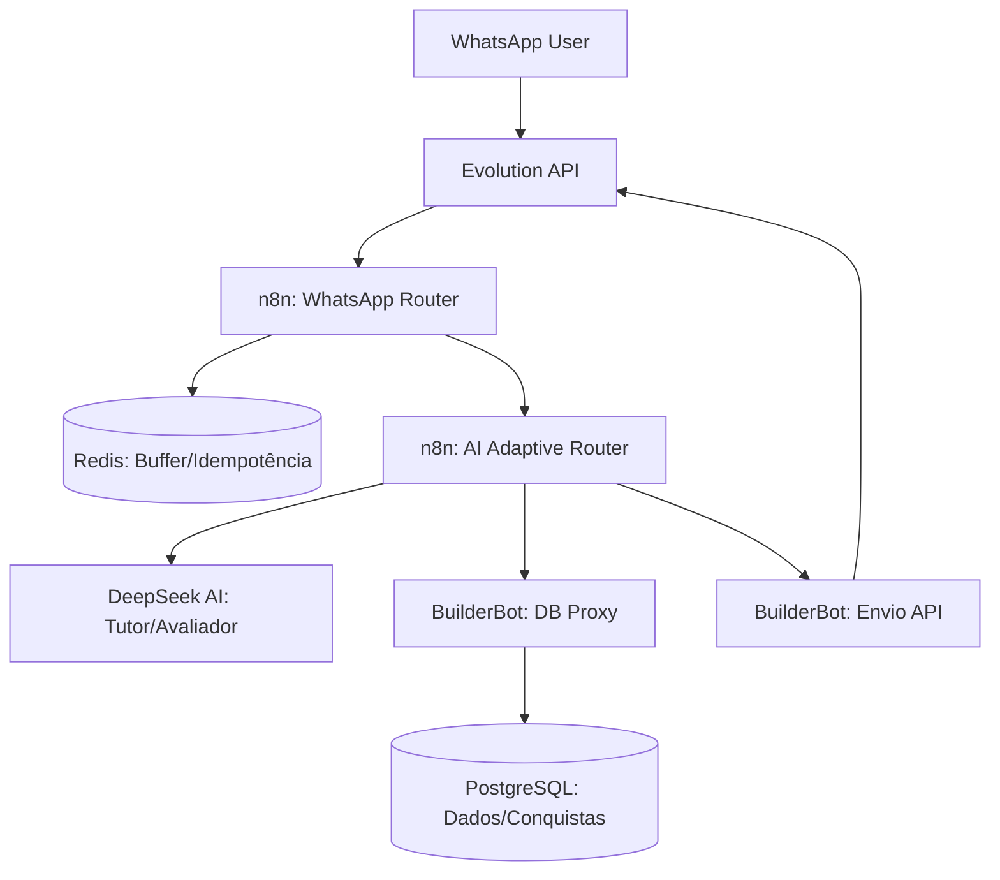

# Arquitetura do Ecossistema Kreativ Educação

Este documento descreve a arquitetura atual, a lógica de funcionamento e os pontos de falha identificados no sistema de orquestração de IA e gamificação.

## 🏗️ Visão Geral da Arquitetura

O sistema é composto por microserviços em containers Docker, orquestrados pelo Coolify e Traefik.

### 1. Camada de Comunicação (Evolution API)
- **Função:** Interface com o WhatsApp (Business API).
- **Instância Ativa:** `europs`.
- **Webhook:** Envia mensagens (`messages.upsert`) para o n8n.

### 2. Camada de Automação (n8n)
- **WhatsApp Router:** 
    - Valida idempotência via Redis (evita duplicidade).
    - Agrupa mensagens enviadas em rajada (burst) usando buffers no Redis.
    - **Lógica de Comando:** Detecta palavras-chave como "QUIZZ" para roteamento especializado.
- **AI Adaptive Router (V2):**
    - **Modo Tutor:** Responde dúvidas técnicas baseadas no contexto do curso e aluno.
    - **Modo Avaliador (QUIZZ):** Compara a resposta do aluno com uma rubrica textual (`evaluation_rubric`) salva no banco.
    - **Self-Healing:** Implementado via `try-catch` em nós de código para evitar travamentos quando dependências (como memórias RLHF) falham.

### 3. Camada de Inteligência (DeepSeek AI)
- Utiliza o modelo `deepseek-chat`.
- Recebe instruções de sistema dinâmicas baseadas na ementa do curso e no histórico de treinamento (training_memory).

### 4. Camada de Gamificação (PostgreSQL)
- **Tabela `achievements`:** Registra medalhas desbloqueadas.
- **Tabela `enrollment_progress`:** Rastreia a conclusão de módulos.
- **Token de Validação:** Gera tokens HMAC-like para autenticidade dos certificados.

---

## 🔍 Lógica do Sistema de QUIZZ

1.  **Detecção:** O n8n intercepta a mensagem se contiver a palavra "QUIZZ".
2.  **Contextualização:** Busca no banco a rubrica do módulo atual do aluno.
3.  **Avaliação:** A IA processa a resposta e retorna um JSON com `score`, `feedback` e `passed`.
4.  **Premiação:** Se `score >= 70`:
    - Insere registro na tabela `achievements`.
    - Envia mensagem de parabéns no WhatsApp.
5.  **Recuperação:** Se `score < 70`:
    - Envia feedback pedagógico e incentiva a revisão.

---

## ⚠️ Falhas Identificadas e Limitações

### 1. Sincronização de Estado do n8n
- **Problema:** Alterações no banco de dados (`active = true` ou `webhook_entity`) não são refletidas imediatamente no motor de execução do n8n sem reinício do container.
- **Impacto:** Erros de 404 e 500 ao tentar acessar webhooks recém-criados.

### 2. Tipagem de Dados no Banco
- **Problema:** Inconsistência entre `course_id` (Integer em `students` vs Character Varying em `modules`).
- **Solução:** Aplicado cast explícito `::text` nas queries do n8n.

### 3. Concorrência no Agregador
- **Problema:** Quando dois nós disparam o mesmo agregador, o n8n pode tentar acessar dados de um nó que ainda não finalizou a execução.
- **Solução:** Uso de `try-catch` e `.first()` na lógica de extração de dados no n8n.

### 4. Dependência de Proxy (BuilderBot)
- **Problema:** O n8n não acessa o Postgres diretamente, mas via `/api/query` do BuilderBot.
- **Impacto:** Aumenta a latência e adiciona um ponto de falha (se o BuilderBot cair, a automação para).

---

## 🛠️ Ferramentas de Manutenção

- `./scripts/test_ecosystem.sh`: Teste de integração completo (E2E).
- `README_TESTS.md`: Manual de debug por módulo.
